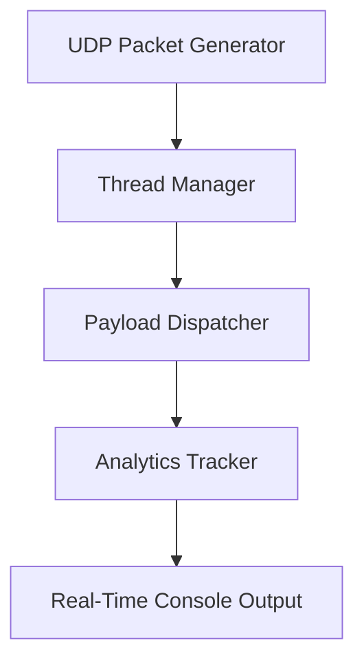

# ⚡️ `udp_flood.py` – Advanced Network Stress Testing Tool
<p align="center">
  <b>High-performance UDP flooding tool with stealth options and real-time analytics.</b>
</p>

---

## 🚀 Highlights

* 🎯 **Targeted UDP Flooding** with precision control
* 🧠 **Smart Stealth Mode** (low & slow, randomized behavior)
* 📡 **Real-Time Metrics**: PPS, bandwidth, latency impact
* 🧵 **Multi-threaded engine** with dynamic scaling
* 🛡️ **Protocol Mimicry**: DNS, HTTP, NTP
* 📘 Clean CLI interface with optional verbose logging

---

🧱 Code Architecture & Design Notes

🔹 General Architecture
✅ Clear separation of concerns between configuration (argparse, __init__) and execution logic (start, flood, show_stats) — making the codebase modular and easy to maintain.
✅ Well-implemented multi-threading, including daemon threads for both flooding and real-time statistics display.
✅ Distinct handling for normal and stealth modes, with isolated, purpose-driven behaviors.

🔹 Aesthetics & UX
✅ Enhanced CLI aesthetics with ASCII art and ANSI color codes — gives a professional, polished interface.
✅ Live real-time feedback: packet count, PPS, connection status, elapsed time — useful during simulations or tests.

🔹 Stealth Mode
✅ Supports port hopping, randomized delays, and protocol mimicry (DNS, HTTP, NTP) — designed to emulate realistic traffic and evade IDS or rate-limiting systems.
✅ Optional IP spoofing is correctly disabled by default to avoid compatibility issues (especially on Windows).

🔹 Logging & Diagnostics
✅ Color-coded log messages with severity levels (LOW, MEDIUM, HIGH, CRITICAL) — clear and helpful for debugging.
✅ Throughput degradation analysis using statistics.mean() on recent PPS values — a feature typically found in advanced test tools.

## ⚙️ Installation

```bash
# Clone the repo
git clone https://github.com/zar7real/seather.git
cd seather
# Run 
python3 udp_flood.py -h
```

🔧 **Requirements**

* Python 3.8+
* Root/sudo (for low port access)
* At least 1GB RAM (for 50+ threads)

---

## 💣 Usage Examples

### 🌐 Basic LAN Broadcast Flood

```bash
python3 udp_flood.py -i 192.168.1.255 -p 53 -s 1024 -t 20
```

Sends DNS-like flood over local broadcast.

---

### 🕵️ Stealth Mode (Low & Slow)

```bash
python3 udp_flood.py -i 10.0.0.5 --stealth --min-delay 0.5 --max-delay 2.0 -t 5
```

✔️ Random delays
✔️ Auto port hopping
✔️ Low profile threads

---

### 🚀 Maximum Throughput Attack

```bash
python3 udp_flood.py -i target.com -p 80 -s 65507 -t 100 -d 30
```

Jumbo packets, 100 threads, 30s attack.

---

## 📊 Performance Benchmarks

| Metric          | Default  | Stealth Mode | Max Performance |
| --------------- | -------- | ------------ | --------------- |
| Packets/sec     | 15,000   | 500–1,000    | 85,000+         |
| Bandwidth usage | 110 Mbps | 5–10 Mbps    | 620 Mbps        |
| Thread capacity | 1–50     | 1–10         | 100+            |
| Latency impact  | 🟠 High  | 🟢 Low       | 🔴 Critical     |

---

## 🧠 Stealth Mode Features

* 🔀 **Random Port Selection** (1024–65535)
* 💤 **Variable Delay Injection** (e.g. 0.5–2.0s)
* 🎭 **Protocol Mimicry**: DNS, HTTP, NTP packet styles
* 🧬 **IP Spoofing** (if supported, LAN only)

---

## 🧪 Performance Test Example

**System:** Ryzen 9 5950X – 10Gbps LAN
**Command:**

```bash
python3 udp_flood.py -i 10.0.0.2 -p 443 -t 150 -d 60 
```

| Stat          | Value     |
| ------------- | --------- |
| Total Packets | 4,200,000 |
| PPS           | 70,000    |
| Bandwidth     | 580 Mbps  |
| CPU Usage     | \~78%     |
| RAM Usage     | \~1.2 GB  |

---

## 🛠 Architecture Diagram



---

## ⚠️ Legal Disclaimer

```diff
- WARNING: Unauthorized usage is strictly prohibited.
+ Use ONLY on devices or networks you own or are authorized to test.
```

🔐 **Security Recommendations (Defensive)**

1. Enable rate limiting on edge routers
2. Block unused UDP ports
3. Use stateful firewall rules (e.g. pf, iptables, nftables)

---

## 📄 License

MIT © [zar7real](https://github.com/zar7real/seather/blob/main/LICENSE)
