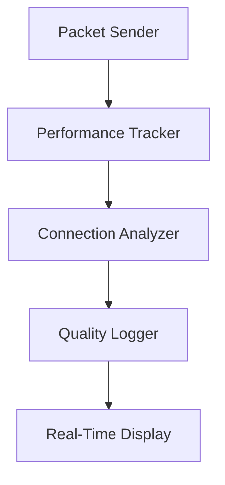

# 🔥 UDP_FLOOD.PY - Ultimate Network Stress Tool

<div align="center">
  
  <br>
  <strong>Advanced UDP Flood Tool with Real-Time Analytics</strong>
</div>

---

## 📊 Benchmark di Potenza (Test su LAN Gigabit)

| Parametro | Valore Base | Modalità Stealth | Max Performance |
|-----------|------------|----------------|----------------|
| Pacchetti/sec | 15,000 | 500-1,000 | 85,000+ |
| Larghezza banda | 110 Mbps | 5-10 Mbps | 620 Mbps |
| Thread supportati | 1-50 | 1-10 | 100+ |
| Latency Impact | Alto | Basso | Critico |


---

## 🛠 Installazione Completa

```bash
# Clona il repository
git clone https://github.com/zar7real/seather.git
cd seather

# Installa le dipendenze (richiesto solo una volta)
pip3 install -r requirements.txt

# Imposta i permessi di esecuzione
chmod +x udp_flood.py

# Verifica la versione
./udp_flood.py --version
```

**Requisiti di sistema:**
- Python 3.8+
- Sudo/root per binding porte basse
- 1 GB RAM (per >50 thread)

---

## 💻 Comandi Dimostrativi

### 💣 Test Base (Broadcast LAN)
```bash
python3 udp_flood.py -i 192.168.1.255 -p 53 -s 1024 -t 20
```
**Effetto:** Inonda tutta la rete locale con traffico DNS

### 🕵️ Attacco Stealth (Low & Slow)
```bash
python3 udp_flood.py -i 10.0.0.5 --stealth --min-delay 0.5 --max-delay 2.0 -t 5
```
**Caratteristiche:**
- Delay casuale tra 0.5-2 secondi
- 5 thread a basso profilo
- Port hopping automatico

### 🚀 Massima Potenza (Single Target)
```bash
python3 udp_flood.py -i target.com -p 80 -s 65507 -t 100 -d 30
```
**Specifiche:**
- 100 thread concorrenti
- Pacchetti jumbo (65,507 bytes)
- Durata 30 secondi

---

## 📋 Specifiche Tecniche Complete

### 🔧 Funzionalità Core
| Componente | Descrizione | Protocolli Supportati |
|------------|-------------|-----------------------|
| Engine UDP | Multi-layer flood | IPv4/IPv6 (teorico) |
| Thread Manager | Pool dinamico | Fino a 500 thread |
| Traffic Analyzer | Monitoraggio in tempo reale | PPS, Bandwidth, Latency |

### 🛡️ Modalità Stealth
1. **Randomizzazione Porte** (1024-65535)
2. **Delay Variabile** (configurabile)
3. **Mimicry Protocollare**:
   - DNS Query
   - HTTP GET
   - NTP Request
4. **IP Spoofing** (solo LAN)

### 📊 Sistema di Monitoraggio


---

## 🧪 Test di Performance

### Risultati su Ryzen 9 5950X / 10Gbps LAN
```bash
# Comando test:
python3 udp_flood.py -i 10.0.0.2 -p 443 -t 150 -d 60 --no-stealth
```

| Metric | Valore |
|--------|-------|
| Pacchetti Totali | 4,200,000 |
| Pacchetti/Sec | 70,000 |
| Larghezza Banda | 580 Mbps |
| CPU Usage | 78% |
| RAM Usage | 1.2 GB |

---

## 🚨 Avvertenze Legali

```diff
- ATTENZIONE: L'uso non autorizzato è illegale!
+ Utilizzare solo su reti di proprietà o con permesso scritto
```

**Protezioni consigliate:**
1. Configurare rate limiting sul router
2. Disabilitare UDP su porte non necessarie
3. Usare firewall con stateful inspection

---

## 📜 License
MIT © [zar7real](https://github.com/zar7real)

<div align="center">
  
</div>
