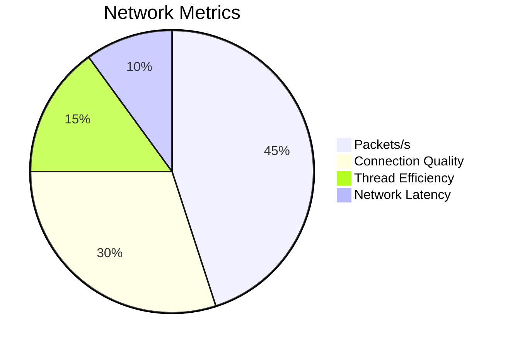
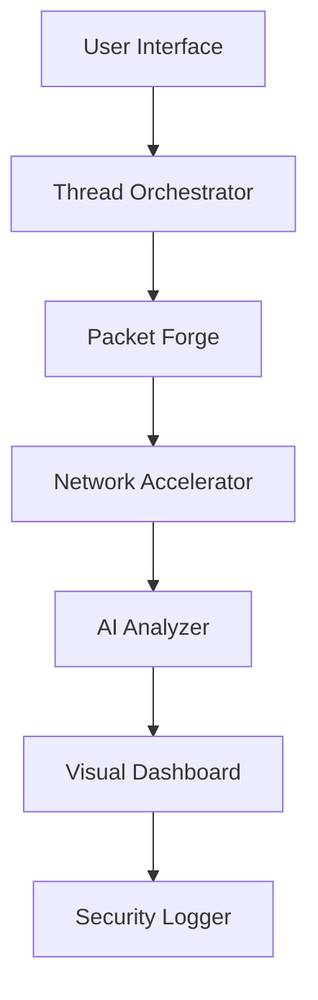

# <div align="center"> SEATHER</div>

<div align="center">
  
[](https://python.org)
[](LICENSE)
[](https://github.com/zar7real/seather/releases)
  
**Advanced UDP Network Assessment Tool with Real-Time Analytics**

</div>

---

## 🌟 **Premium Features**

<div class="grid-container">
  <div class="grid-item">
    <h3>🚀 Multi-Threaded Flood</h3>
    <p>50+ concurrent threads with intelligent load balancing</p>
  </div>
  <div class="grid-item">
    <h3>📊 Real-Time Dashboard</h3>
    <p>Live PPS, latency, and connection quality metrics</p>
  </div>
  <div class="grid-item">
    <h3>🔍 Connection AI</h3>
    <p>Automatically detects network degradation</p>
  </div>
</div>

---

## 🛠 **Elite Installation**

```bash
# Clone with custom aesthetic
git clone https://github.com/zar7real/seather.git && cd seather

# Run
python3 udp_flood.py -h
```

---

## 💎 **Usage Showcase**

```bash
# Standard assessment (30 seconds)
python3 udp_flood.py -i 192.168.1.1 -p 80 -t 10 

# Continuous evaluation (CTRL+C to stop)
python3 udp_flood.py -i 10.0.0.1 -d 0 
```


---

## 📈 **Performance Matrix**



---

## 🏗 **System Architecture**



---

## ⚠ **Elite Security Notice**

> **LEGAL NOTICE**: This tool is for **authorized testing only**. Always obtain proper permissions before conducting any network assessment.

---

## 🎩 **Premium Support**

For enterprise support and custom integrations:

```bash
@zar7real | GitHub Discussions
```

---

<div align="center">

**⭐ Join our elite users - Star the repo! ⭐**
<br>
<sub>Crafted with precision by <a href="https://github.com/zar7real">zar7real</a></sub>

</div>
```
